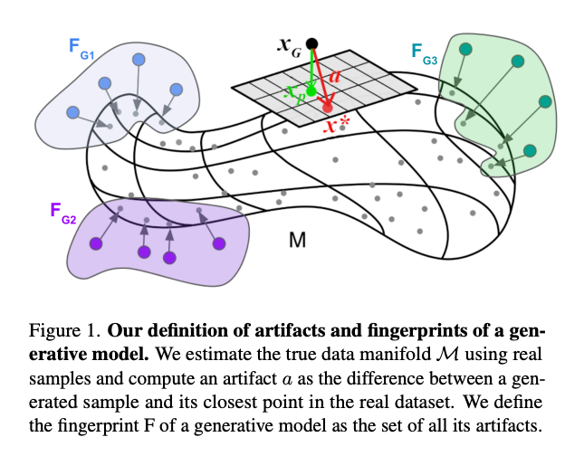
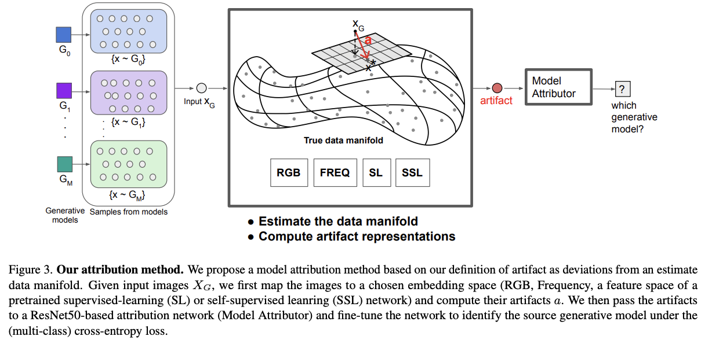
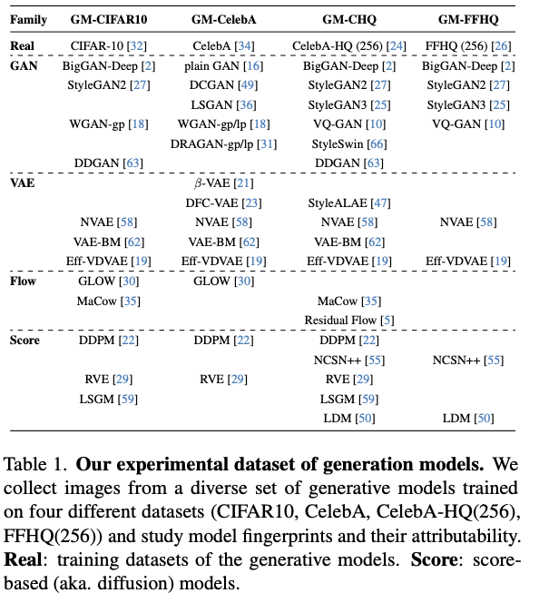
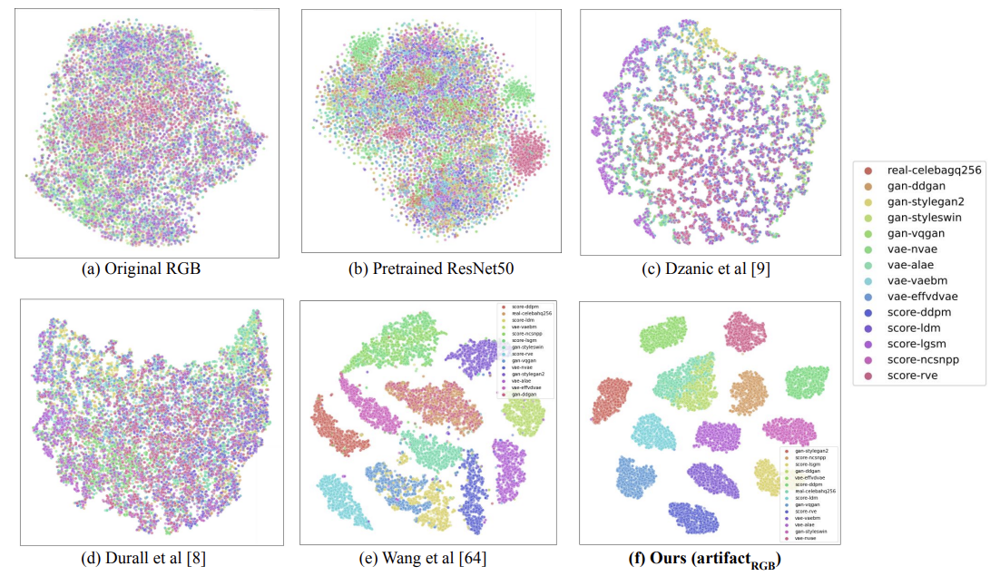
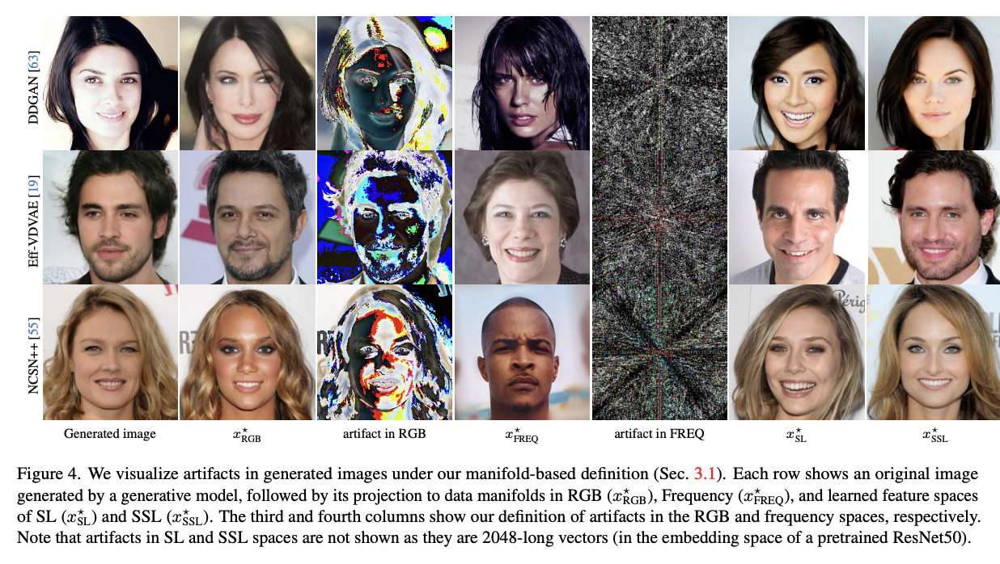
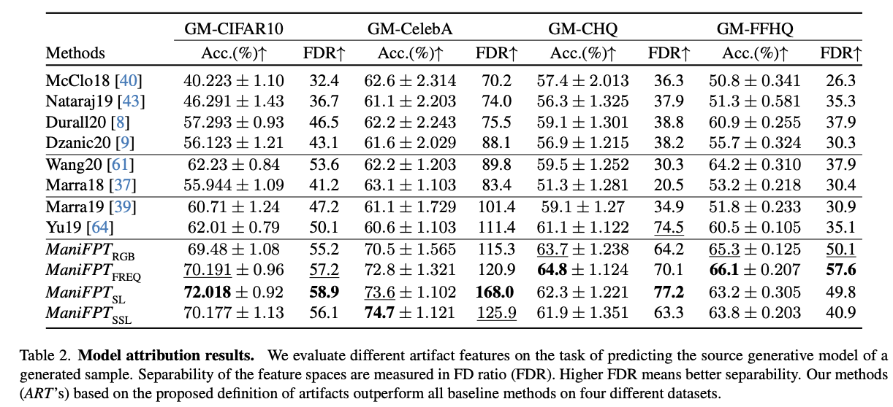
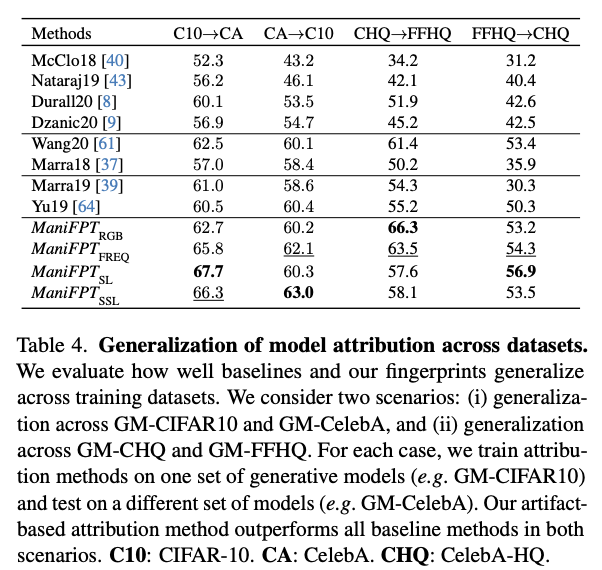
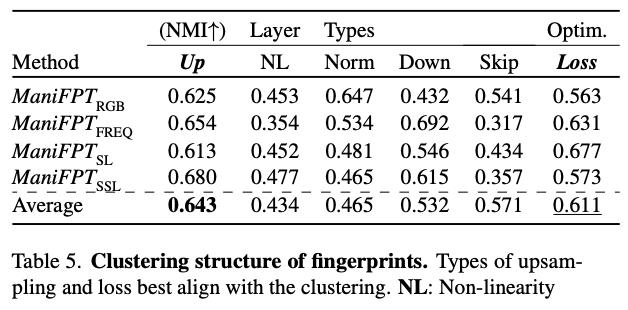

# Simple demo of artifacts and fingerprints of generative models
Paper (accepted to CVPR24): [arxiv:2402.10401](https://arxiv.org/abs/2402.10401)

  

    
  

## Abstract
Recent works have shown that generative models leave
traces of their underlying generative process on the generated samples, broadly referred to as fingerprints of a generative model, and have studied their utility in detecting
synthetic images from real ones. However, the extend to
which these fingerprints can distinguish between various
types of synthetic image and help identify the underlying
generative process remain under-explored. In particular,
the very definition of a fingerprint remains unclear, to our
knowledge. To that end, in this work, we formalize the definition of artifact and fingerprint in generative models, propose
an algorithm for computing them in practice, and finally
study its effectiveness in distinguishing a large array of different generative models. We find that using our proposed
definition can significantly improve the performance on the
task of identifying the underlying generative process from
samples (model attribution) compared to existing methods.
Additionally, we study the structure of the fingerprints, and
observe that it is very predictive of the effect of different
design choices on the generative process.

## Our Model Attribution Workflow

  

    
  

## Our dataset of generative models 
- includes all four main families of generative models (VAE, GAN, Flow-based, Diffusion models)
- includes SoTA models

  

    
  

## Results
### tSNE of GM fingerprint features

  

    
  

### Visualization of artifacts

  

    
  

### Model attribution accuracy

  

    
  

### Cross-dataset Generalization 

  

    
  

### Structure of artifacts

  

    
  

## TODO:
- [ ] make my project page

  
Linked above are some examples of vision classifiers using JavaScript from [fast.ai](https://course.fast.ai) staff and students. Also, check out these other examples from students, along with the [fast.ai forums](https://forums.fast.ai) username of each contributor:

- [predict_image](https://github.com/nuvic/predict_image) h/t nuvic
- [Dog vs Cat](https://edwardjross.github.io/gradio-image-demo/) h/t edwardjross 
- [Food classifier](https://suvash.github.io/very-basic-gradio-api-app/) h/t suvash 
- [webcam interface](https://misza222.github.io/hf_api_predict/) h/t misza222
- [Get to know your pet](https://gettoknowyourpet.com/) h/t aabdalla
- [pyscript app](https://matdmiller.github.io/fastai-huggingface-sample-web-app1/pyscript-classifier.html) h/t matdmiller
